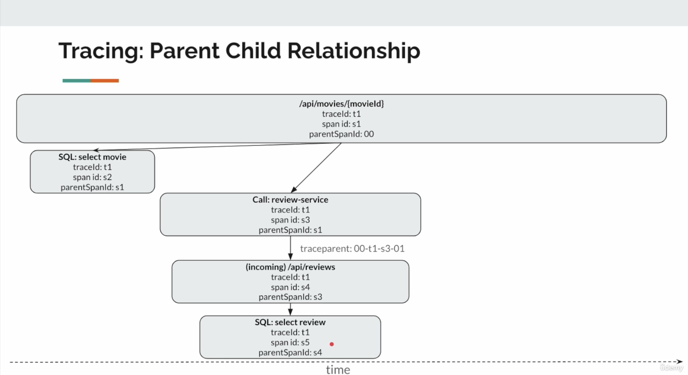

# Distributed Tracing
* Tracking the flow of a request as it travels through a distributed system.
* A single user call will trigger multiple backend services
* Trace -> The complete journey of a request
* Span -> Each step in the journey is recorded as a span
  * A unit of work -> A DB HTTP call / DB Call for example
* Trace = Collection of Spans

## Automatic Instrumentation
* NO code change inside /src/main/java
* We attach an agent at runtime
  * This agent runs alongside your application and captures the request.
  * We configure the agent via environment variables / command line options - NOT by modifying the source code

## OpenTelemetry Architecture
* OpenTelemetry Agent
  * standalone executable jar file / a set of libs
  * OpenTelemetry provides this agent

### OpenTelemetry Agent
* ByteCode Manipulation
* Spring (SpringBoot, WebMVC, WebFlux)
* Servlet Containers (Tomcat, Jetty, etc...)
* HTTP Clients (RestClient, WebClient, HTTP Client...)
* Databases (JDBC, R2DBC)
* Messaging (Kafka, RabbitMQ, JMS...)

### OpenTelemetry Collector
* Otel-Collector
  * Vendor-Agnostic proxy that receives, process and exports telemetry data!
  * A central hub for all the observability data
  * It decouples our application from the destination of telemetry data

## Tracing: Parent Child Relationship
* traceId
* Span
  * name (GET /api/reviews, DB QUery)
  * spanId (unique identifier for each span)
  * traceId (shared across all spans that belong to the same trace)
  * parentSpanId (if any. For ex: DB query as part of incoming request)
  * startTime
  * endTime
  * attributes
  * ...
  * ...

## Attributes: Span vs Resource
* Resource Attributes
  * Belong to the service/process which emits telemetry data
    * service-name: movie-service
    * container.id: 03434322
    * aws.region: us-east-1
  * They remain the same for all the spans!
* Span Attributes
  * Belong to a specific span (operation)
    * http.method: GET
    * url.path: /api/movies/1
    * db.statement: SELECT * from reviews WHERE movieId=1