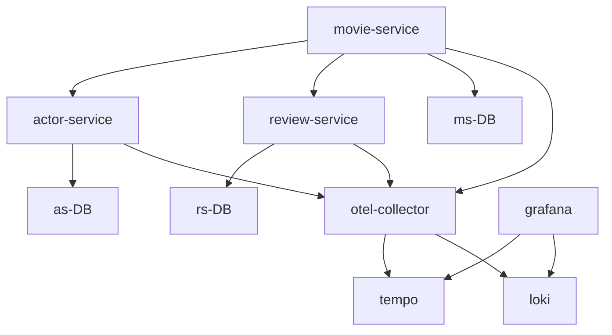
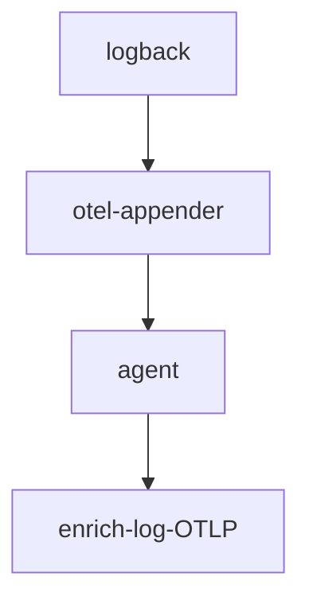

# Logs
* Log is a time-stamped record of events or messages generated by an application.
* It captures information about what the application is doing.
  * Requests the application receives
  * Errors or failures encountered
  * Business decisions or actions taken by the application, along with the context or conditions that led to them.

Note: Why do we need logging when we have distributed tracing?  
* Imagine a complex e-commerce application with many business rules.
  * Customer 1 request a product refund -> refund is approved
  * Customer 2 request a product refund -> refund is denied

1. The tracing shows what happened and how long it took
2. The log explains why the decision was made

### Challenges
* Multiple services
* Multiple instances
* Multi-threaded execution
* Request Correlation

### Goal
* Collect logs from all services and instances into a centralized system using the opentelemetry collector
* Correlate logs with specific requests or transactions for easier debugging
* Visualize and explore logs in Grafana
* Achieve this without changing existing logging code, making observability seamless in a distributed environment

### Logging / Error Handling
* Add logging / error handling to the trace-flix application (java source code)
* build the images again
* mvn clean install
* docker compose up --build

### Need for Open Telemetry LogBack Appender
* Goal
  * Collect logs from all services and instances into a centralized system using the OpenTelemetry Collector
  * Correlate logs with specific requests or transactions for easier debugging
  * Visualize and explore logs in Grafana
  * Achieve this without changing existing logging code, making observability seamless in a distributed environment

The agent cannot send the logs to otel-collector automatically.  
This is because we use Logback framework.  
Logback Appender.  appender decides where the log goes.  

Logback Appender.  

The agent can enrich the log with the tracing information while exporting.  

We need a logback **appender** to capture logging events.  
1. pom.xml: Add the otel dependency for appender
2. logback.xml: Configure to use the appender
3. mvn clean install
4. docker compose build
