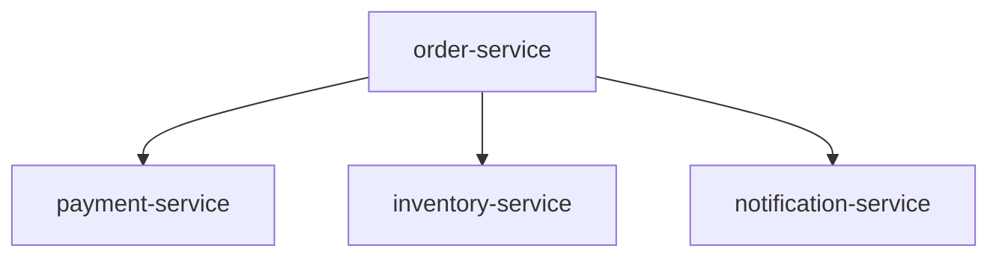
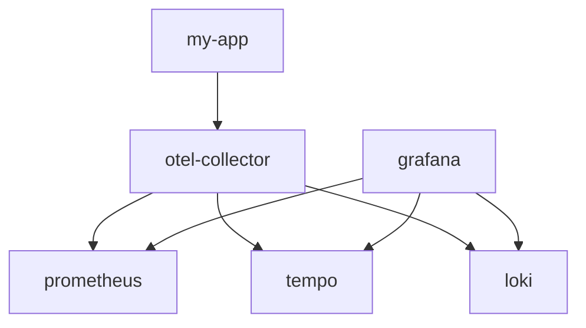

# Manual Instrumentation

## OpenTelemetry
* It is an interface/main entrypoint to the OpenTelemetry API
* It is the bridge between our application and OpenTelemetry SDK
* A central registry and factory that gives tracers and meters, and manages how traces, metrics and logs are processed and exported.
  * TracerProvider -> tracing
  * MeterProvider -> metrics
  * LoggerProvider -> logs

```java
public interface OpenTelemetry {

    TracerProvider getTracerProvider();
    MeterProvider getMeterProvider();
    LoggerProvider getLogsBridge();

}

OpenTelemetrySdk.buidler()
    .setMeterProvider(meterProvider())
    .setTracerProvider(tracerProvider())
    .setLoggerProvider(loggerProvider())
    .build();

```

## Order Processing


```java
// tracer is a lightweight, thread-safe object.
// create it once (similar to a spring bean)
private static final Tracer tracer = OpenTelemetryConfig.tracer(Lec01SpanBasicsDemo.class);

// whenever we process a request.
// We create a new Span using the tracer/
Span span = tracer.spanBuilder("process order").startSpan();

doSomeWork();

span.end();
```

### Manual Instrumentation Example Flow



#### Hands on
* go to the 06-manual-instrumentation-playground folder
* docker compose up
* execute the application and access grafana to see the traces

## Span Parent Child Relationship
* Context
  * Context is an **immutable** object that holds the current span and other tracing-related information. This Context object can be shared across threads and services, allowing different parts of the application to associate their work with the same trace.

```java
store span1 ---> Context

associate to

private void method2() {
    var span2 = tracers.spanBuilder("span2").startSpan();
}
```


* Context Storage (ThreadLocal)
  * It uses **ThreadLocal** for storage
    * [You can imagine it as a map where the key is the current thread and the value is the Context]


#### Example No Parent Child Relationship
```java

void method1() {
    var span1 = tracer.spanBuilder("span1").startSpan();

    method2();

    ...
    ...

    span1.end();
}

void method2() {
    var span2 = tracer.spanBuilder("span2").startSpan();

    ...
    ...
    span2.end()
}

```


#### Example With Parent Child Relationship
```java

void method1() {
    var span1 = tracer.spanBuilder("span1").startSpan();

    try (var scope = span1.makeCurrent()) {
        method2();
    }
    

    ...
    ...

    span1.end();
}

void method2() {
    var span2 = tracer.spanBuilder("span2").startSpan();

    ...
    ...
    span2.end()
}

```

### Context
```java
// Context.current()
// Returns the current context from ContextStorage
// If no Context has been stored yet, this does NOT return null
// Instead, it will returns the root Context - a special Context without any span.
Context.current();

// How to add a span to a Context?
// 
// Returns a NEW Context object that contains the given span.
// Important: Context is immutable. The existing Context is not modified.
// A new Context instance is created with the span included.
Context.current().with(span);
```


### Example
```java
var span1 = tracer.spanBuilder("span1").startSpan();

var span2 = tracer.spanBuilder("span2").startSpan();
```


```java
var span1 = tracer.spanBuilder("span1").startSpan();

var span2 = tracer.spanBuilder("span2")
        .setParent(Context.current().withSpan(span1)) // sets span1 as parent
        .startSpan();
```

What is the use case for this?  
This one is great when we have multiple threads, because the other option with ``` span.makeCurrent() ``` uses thread local.  

### Context Propagation
* Context propagation is the mechanism by which execution context (CONTEXT) is passed along as a request moves through different parts of a system (such as between threads, methods, or services).
  * It ensures that all operations related to the same logical transaction can be linked together into a single trace.


### Span Kind
```java
var span = tracer.spanBuilder("processOrder")
                .setSpanKind(SpanKind.SERVER)
                .startSpan();
```

Alailable SPAN Kinds:  
* SERVER (incoming requests)
* CLIENT (outgoing requests)
* PRODUCER (send message/event)
* CONSUMER (receiving message/event)
* INTERNAL (operations that are not network calls or messaging)


## Metrics (Manual)

### Types of Metrics
* Counter
  * only goes UP
    * number of requests processed
    * number of errors
* Gauge / UpDownCounter
  * Can go up and down
    * CPU Usage
    * Available Inventory
* Histogram
  * Distribution of values
    * Request latency (requests completed in < 10m <50m, <100ms, etc...)
    * Size of uploaded files (<10MB, <50MB...)

### Metrics Naming Convention
* ```[namespace].[entity or domain].[operation or action].[type or unit]```
  * namespace -> high-level system area (http, db, jvm, app)
  * entity/domain -> what the metric is about (server, client, memory, product)
  * operation/action -> what is happening (request,view,usage)
  * type/unit -> nature or the value (duration, count, utilization)
* Good
  * http.server.request.duration
  * http.client.active_requests
  * jvm.memory.utilization (NOT jvm.memory.usage.utilization)
  * app.product.view.count
  * trace_flix.movie.view.count (NOT trace.flix.movie.view.count)
* Bad
  * memory.utilized.by.jvm

### Metric Attributes Naming
* ```[namespace].[property]/[entity].[property]```
* Good
  * http.method
  * http.route
  * url.path
  * product.id
  * movie.category

### Metric Unit

```java
meter.counterBuilder("app.product.view.count")
    .setDescription("Total number of product view")
    .setUnit("1")
    .build();
```


| Type                 | Unit   | Comment   
|--------------------------|-----------|---------------|
| Dimensionless Counts      |  1, {request}, {error}, {rbc}|   plain count, request count, error count, red blood cells count        |
| Duration      |  s, ms, us, ns|   Seconds, Miliseconds, microseconds, nanoseconds        |
| Data      |  By   |   bytes        |
| Ratio/Percentage      |  1, %|   0-1, 0-100        |


### Gauge
```java

meter.gaugeBuilder("jvm.memory.used")
    .ofLongs()
    .setDescription("The amount of JVM memory currently used")
    .setUnit("By")
    .buildWithCallback(o -> {
        var usedMemory = Runtime.getRuntime().totalMemory - Runtime.getRuntime().freeMemory();
        o.record(usedMemory);
    });

```

### UpDown Counter
* To track values that can go up and down
* Gauge
  * We track the actual value at a point in time!
* UpDownCounter
  * We track the changes (increments / decrements) over time!

UpDown Counter:  
* We track the changes
* Bank Account
  * +10
  * +20
  * +30
  * +5
  * -45
  * +3
* We track the changes (increments/decrements) over time!
* Use cases:
  * Active Sessions:
    * +1 for login, -1 for logout
  * Pending jobs in the queue
    * +1 when a job enters the queue, -1 when it is processes
  * Open Connection
    * +1 when a connection is created, -1 when it is closed


### Histrogram
* To track the distribution of values
* Example:
  * 10K tasks
  * Each task takes between 100ms and 10s
* Distribution
  * 1000 tasks < 1s
  * 2200 tasks < 2s
  * 3100 tasks < 3s
  * ...
  * ...


## Logs
* MDC
* TurboFilter

### MDC 
* Mapped Diagnostic Context
* Enrich Logs with contextual information automatically included in every log message

#### Problem Statement
* Logs show the amount, but no information about which user or request this belongs to.
* If multiple payments are processed, it is impossible to correlate logs to a specifc user.
* Manually adding the userId or other context everywhere is tedious and error-prone.
```java

public void processPayment(PaymentDetails paymentDetails) {
    ...
    ...
    log.info("Payment processed. Amount: {}", paymentDetails.getAmount());
}

```


#### MDC example
MDC uses ThreadLocal.  
```java
// when the user logs in or a request starts
MDC.put("userId", "123");

public void processPayment(PaymentDetails paymentDetails) {
    ...
    ...
    log.info("Payment processed. Amount: {}", paymentDetails.getAmount());
}

public void sendNotification(NotificationDetails details) {
    log.info("Notification Email sent");
}

// when the user logs out or request ends
MDC.clear();

// final log message example:
// INFO [userId=123] Payment processed. Amount: 250.00
// INFO [userId=123] Notification Email Sent
```


### TurboFilter
#### Problem Statement
* INFO
  * Record high level application flow and important business events.
  * Less verbose
  * Suitable for production
* DEBUG
  * Record internal state of the application for troubleshooting. Contains detailed technical information such as variable values, object states and steps inside an algorithm, etc...
  * Very verbose
  * NOT suitable for production
* We cannot turn on DEBUG globally
  * The service handles thousands of requests per second
  * Enabling DEBUG for all requests would flood your logs, make it harder to find relevant information, and potentially affect performance

#### Targeted Debugging
* Sometimes an issue occurs only for a particular user, order, or request. You need detailed context for that single request/transaction
  * **TurboFilter** can enable DEBUG logging dynamically based on certains conditions.