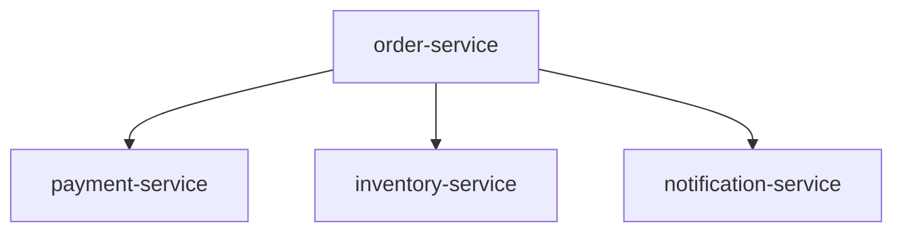
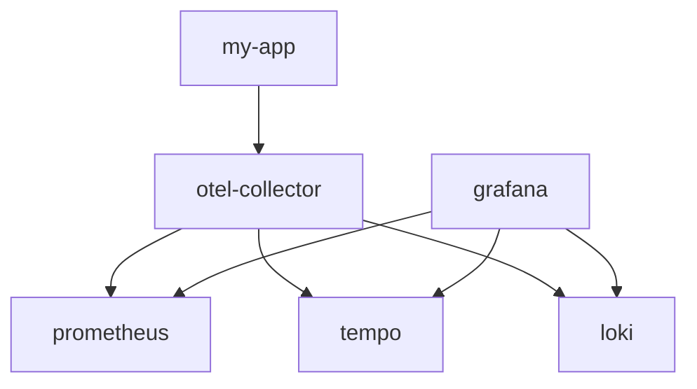

# Manual Instrumentation

## OpenTelemetry
* It is an interface/main entrypoint to the OpenTelemetry API
* It is the bridge between our application and OpenTelemetry SDK
* A central registry and factory that gives tracers and meters, and manages how traces, metrics and logs are processed and exported.
  * TracerProvider -> tracing
  * MeterProvider -> metrics
  * LoggerProvider -> logs

```java
public interface OpenTelemetry {

    TracerProvider getTracerProvider();
    MeterProvider getMeterProvider();
    LoggerProvider getLogsBridge();

}

OpenTelemetrySdk.buidler()
    .setMeterProvider(meterProvider())
    .setTracerProvider(tracerProvider())
    .setLoggerProvider(loggerProvider())
    .build();

```

## Order Processing


```java
// tracer is a lightweight, thread-safe object.
// create it once (similar to a spring bean)
private static final Tracer tracer = OpenTelemetryConfig.tracer(Lec01SpanBasicsDemo.class);

// whenever we process a request.
// We create a new Span using the tracer/
Span span = tracer.spanBuilder("process order").startSpan();

doSomeWork();

span.end();
```

### Manual Instrumentation Example Flow



#### Hands on
* go to the 06-manual-instrumentation-playground folder
* docker compose up
* execute the application and access grafana to see the traces

## Span Parent Child Relationship
* Context
  * Context is an **immutable** object that holds the current span and other tracing-related information. This Context object can be shared across threads and services, allowing different parts of the application to associate their work with the same trace.

```java
store span1 ---> Context

associate to

private void method2() {
    var span2 = tracers.spanBuilder("span2").startSpan();
}
```


* Context Storage (ThreadLocal)
  * It uses **ThreadLocal** for storage
    * [You can imagine it as a map where the key is the current thread and the value is the Context]


#### Example No Parent Child Relationship
```java

void method1() {
    var span1 = tracer.spanBuilder("span1").startSpan();

    method2();

    ...
    ...

    span1.end();
}

void method2() {
    var span2 = tracer.spanBuilder("span2").startSpan();

    ...
    ...
    span2.end()
}

```


#### Example With Parent Child Relationship
```java

void method1() {
    var span1 = tracer.spanBuilder("span1").startSpan();

    try (var scope = span1.makeCurrent()) {
        method2();
    }
    

    ...
    ...

    span1.end();
}

void method2() {
    var span2 = tracer.spanBuilder("span2").startSpan();

    ...
    ...
    span2.end()
}

```